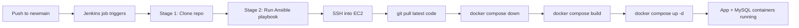

# TypeRush

A typing speed test web app. Race against the clock, track your words-per-minute and accuracy, and compete on a shared leaderboard.

## Features

- **Typing test** — 20s or 30s modes, with Normal / Expert / Master difficulty and an optional Blind Mode (hides real-time error highlighting)
- **Accounts** — register, log in, log out, and reset a forgotten password
- **Leaderboard** — ranks logged-in players by score, per time mode, backed by a shared MySQL database
- **Settings** — difficulty, blind mode, and accuracy-threshold preferences, saved per browser

## Tech stack

- **Backend**: Node.js, Express, EJS templates
- **Database**: MySQL (via `mysql2`)
- **Auth**: `express-session` for sessions, `bcryptjs` for password hashing
- **Frontend**: vanilla HTML/CSS/JS (no framework)

## Getting started

### Prerequisites

- Node.js
- A running MySQL instance (locally installed, or via Docker — see `docker-compose.yaml`)

### 1. Install dependencies

```bash
npm install
```

### 2. Configure environment variables

Create a `.env` file in the project root:

```
DB_HOST=localhost
DB_PORT=3306
DB_USER=typerush
DB_PASSWORD=your-db-password
DB_NAME=typerush_db
SESSION_SECRET=some-random-string
PORT=3000
```

### 3. Run it

```bash
npm run dev
```

On first run, the app automatically creates the database and tables (`users`, `scores`, `password_resets`) if they don't already exist. Visit `http://localhost:3000`.

## Project structure

```
app.js                  Express app: routes, session/auth, DB setup
views/                  EJS templates (one per page)
views/partials/         Shared nav/header/footer includes
public/css/game.css     Site-wide styles
public/js/auth-nav.js   Shared login/logout nav state
k8s/                    Kubernetes manifests for running the stack locally via Minikube (not part of the deployed pipeline)
ansible/, Jenkinsfile   CI/CD: deploys to AWS EC2 via Ansible + Docker Compose
.github/workflows/      Trivy security scan (source + built image), runs on push/PR and daily
```

## API routes

| Method | Route | Purpose |
|---|---|---|
| POST | `/api/register` | Create an account |
| POST | `/api/login` | Log in, starts a session |
| POST | `/api/logout` | End the session |
| POST | `/api/forgot-password` | Generate a password reset link |
| POST | `/api/reset-password` | Set a new password from a reset link |
| GET | `/api/leaderboard?timeLimit=20\|30` | Fetch ranked scores for a time mode |
| POST | `/api/leaderboard` | Save a completed run's score |

## Deployment

The live app is deployed automatically from `newmain` through a CI/CD pipeline: **GitHub → Jenkins → Ansible → Docker Compose**, running on an AWS EC2 instance.



**1. Jenkins** ([`Jenkinsfile`](Jenkinsfile)) — a two-stage pipeline:
- **Clone Repository**: pulls the `newmain` branch from GitHub
- **Deploy to AWS EC2**: runs `ansible-playbook -i ansible/inventory.ini ansible/deploy.yaml`

Jenkins itself runs in a custom container ([`JenkinsDocker/Dockerfile`](JenkinsDocker/Dockerfile)) with Docker, Docker Compose, Ansible, and an SSH client preinstalled, since the pipeline needs all of those to actually build images and deploy remotely.

**2. Ansible** ([`ansible/deploy.yaml`](ansible/deploy.yaml)) — connects to the target EC2 instance (defined in [`ansible/inventory.ini`](ansible/inventory.ini), via SSH key) and runs, in order:
1. `git pull origin newmain` — get the latest code
2. `docker compose down` — stop the currently running containers
3. `docker compose build` — rebuild the app image with any new code/dependencies
4. `docker compose up -d` — start everything again in the background

**3. Docker Compose** ([`docker-compose.yaml`](docker-compose.yaml)) — runs two containers together:
- `typerush` — the app itself, built from the root [`Dockerfile`](Dockerfile), exposed on port 3000
- `mysql` — the database, using the official `mysql:8.0` image, with its data kept in a persistent Docker volume so it survives restarts

**4. Security scanning** ([`.github/workflows/trivy.yml`](.github/workflows/trivy.yml)) — runs separately, on GitHub Actions rather than Jenkins. On every push/PR to `newmain` (plus a daily schedule), it scans the source code and dependencies for vulnerabilities/secrets, then builds the Docker image and scans that too, publishing the results as a workflow summary and downloadable report. It's currently informational only — it doesn't block a deploy if it finds something.

### Local-only Kubernetes demo

A separate Kubernetes setup lives in [`k8s/`](k8s/) — three manifests (`app-deployment.yaml`, `mysql-deployment.yaml`, `mysql-secret.yaml`) that run the same app + database stack under Minikube, entirely on your own machine. It's completely independent of the pipeline above: nothing in `ansible/deploy.yaml` or the Jenkins pipeline references it, so it's safe to experiment with without any risk to the live site.
